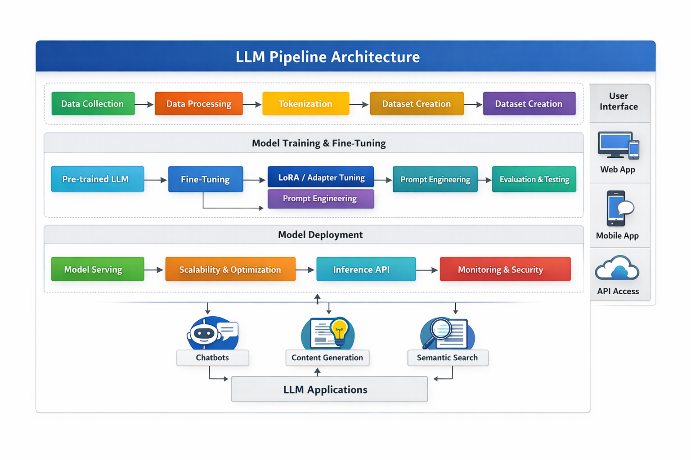
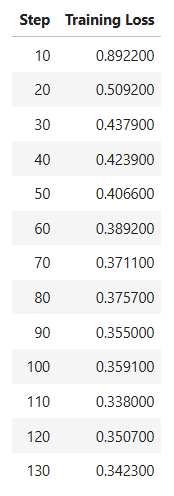
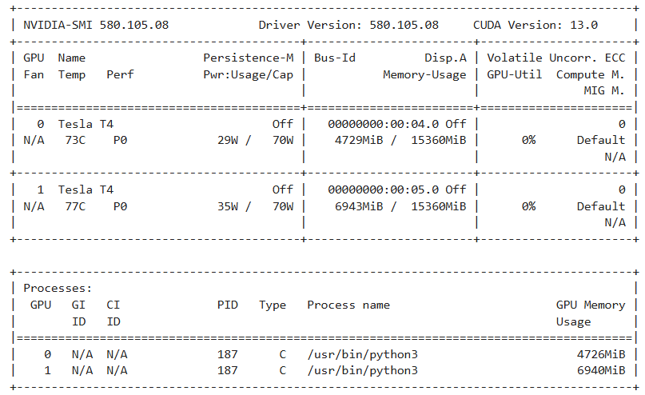
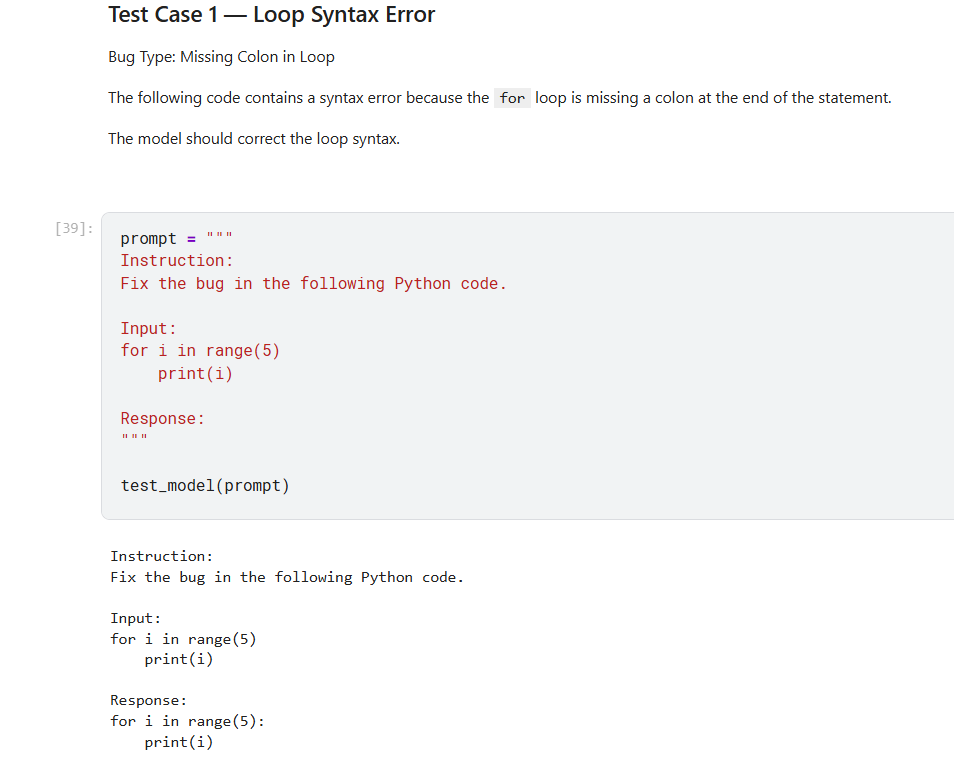

<h1 align="center">CodeRepair-LLM</h1>

<h3 align="center">
DebugGPT — Automated Python Bug Fixing using Fine-Tuned LLMs
</h3>

<i>A Decentralized Framework for Autonomous Agent Collaboration</i>

Build intelligent AI systems that detect, analyze, and repair buggy Python code using fine-tuned Large Language Models.

<a href="#installation">Installation</a> •
<a href="#usage">Usage</a> •
<a href="#results">Results</a> •
<a href="#repository-structure">Repository Structure</a> •
<a href="#license">License</a>

---

# Project Overview

Large Language Models (LLMs) have demonstrated strong capabilities in reasoning, code generation, and software development tasks. This project explores **fine-tuning an open-weight LLM to automatically detect and repair buggy Python code.**

The system adapts the **Phi-3 Mini (4K Instruct)** model using **LoRA (Low-Rank Adaptation)**, a parameter-efficient fine-tuning method that significantly reduces GPU memory requirements while preserving strong performance.

The goal of this project is to demonstrate a **complete LLM fine-tuning workflow**, including:

- Dataset preparation
- Baseline model evaluation
- Parameter-efficient fine-tuning using LoRA
- Post-training evaluation
- Model packaging for reuse

This repository provides a **reproducible implementation** for training LLMs on code repair tasks using the HuggingFace ecosystem.

---

## Architecture

The following diagram illustrates the pipeline used for training and evaluating the bug-fixing LLM.

The pipeline includes:

• Dataset preparation  
• Instruction formatting  
• LoRA fine-tuning of Phi-3 Mini  
• Model evaluation  
• Bug-fix inference generation

---

# Dataset

This project uses the **MBPP (Mostly Basic Python Problems)** dataset available through the HuggingFace Datasets library.

MBPP contains Python programming tasks designed to evaluate code generation and reasoning abilities.

Each training sample contains:

- A programming instruction
- A buggy Python code snippet
- A corrected code solution

Example training format:

Instruction: Fix the bug in the following Python code.

Input:
def add(a,b)
return a+b

Response:
def add(a,b):
return a+b

The dataset was formatted into **instruction-response pairs**, allowing the model to learn the structure of debugging tasks.

Dataset splits:

| Split | Samples |
|------|--------|
| Train | ~374 |
| Validation | ~90 |
| Test | ~500 |

---

# Model

Base Model:

**Phi-3 Mini (4K Instruct)**  
Developed by Microsoft.

Key characteristics:

- 3.8B parameter lightweight LLM
- Strong reasoning performance
- Efficient for fine-tuning on a single GPU

Fine-tuning method:

**LoRA (Low Rank Adaptation)**

LoRA injects small trainable matrices into the attention layers, allowing the model to adapt to new tasks while keeping most original weights frozen.

Benefits:

- Reduced GPU memory usage
- Faster training
- Minimal performance loss

---

## Model Availability

The fine-tuned LoRA adapter is available on HuggingFace.
---

# Fine-Tuning

The model was fine-tuned using the **HuggingFace Transformers ecosystem**.

Libraries used:

- Transformers
- PEFT
- TRL
- Datasets
- Accelerate

Training configuration:

| Parameter | Value |
|----------|------|
| Base Model | Phi-3 Mini |
| Fine-Tuning Method | LoRA |
| LoRA Rank | 16 |
| LoRA Alpha | 32 |
| Epochs | 3 |
| Learning Rate | 2e-4 |
| Batch Size | 1 |
| Gradient Accumulation | 8 |
| Hardware | NVIDIA Tesla T4 GPU |

Training was completed in approximately **7 minutes** using GPU acceleration.

---

## Experiment Tracking

Training experiments were tracked using **Weights & Biases**.

W&B Dashboard:

https://wandb.ai/suddhumaddi-woxsen-university/huggingface

Tracked metrics include:

• training loss  
• training steps  
• runtime statistics  
• GPU utilization

---

# Results

The fine-tuned model demonstrates improved ability to repair buggy Python code.

Example:

### Input

def is_even(n):
if n % 2 == 1:
return True
else:
return False

### Model Output

def is_even(n):
if n % 2 == 0:
return True
else:
return False

Training loss progression:

GPU training confirmation:

Example bug-fix output:

---

# Installation

Clone the repository:

git clone https://github.com/YOUR_USERNAME/code-repair-llm.git

cd code-repair-llm

Install dependencies:

pip install -r requirements.txt

Recommended environment:

- Python 3.10+
- CUDA GPU (Tesla T4 or higher)

---

# Usage

Run the training notebook:

notebook/llm_bug_fix_finetuning.ipynb

The notebook includes the full pipeline:

1. Dataset loading
2. Prompt formatting
3. Baseline evaluation
4. LoRA fine-tuning
5. Model evaluation
6. Model export

Example inference:

prompt = """
Instruction:
Fix the bug in the following Python code.

Input:
def add(a,b)
return a+b

Response:
"""

The model generates the corrected code automatically.

---

# Repository Structure

code-repair-llm
│
├── README.md
├── LICENSE
├── requirements.txt
│
├── notebook
│ └── llm_bug_fix_finetuning.ipynb
│
├── model
│ └── bug_fix_adapter
│
├── results
│ ├── training_log.png
│ ├── gpu_training.png
│ └── model_bug_fix_example.png
│
└── docs
└── methodology.md

---

# Reproducibility

The project is fully reproducible.

Steps to reproduce:

1. Install dependencies
2. Load the dataset from HuggingFace
3. Run the fine-tuning notebook
4. Evaluate model outputs

All configuration parameters are documented inside the notebook.

---

# License

This project is released under the **MIT License**.

You are free to:

- Use
- Modify
- Distribute

See the LICENSE file for details.

---

# Acknowledgements

This project uses open-source tools from the following ecosystems:

- HuggingFace Transformers
- HuggingFace Datasets
- PEFT
- TRL
- PyTorch

---

# Author

**Sudarshan Maddi**

Data Science Undergraduate  
Woxsen University
